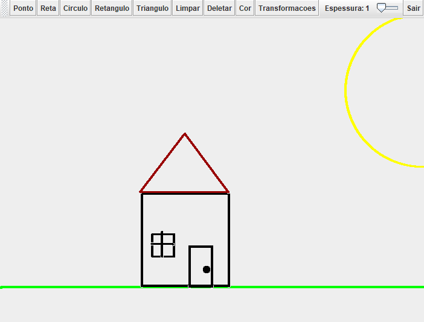

# ✏️ Sistema de Desenho

  

Esse repositório contém cada artefato produzido para o desenvolvimento de um sistema de desenhos 2D prototipada e implementada em Java.

--- 

# 📌 Funcionalidades da Aplicação

- Desenho de formas geométricas: reta, circunferência e triângulo  
- Elasticidade aplicada a cada forma desenhada  
- Transformações geométricas disponíveis:
  - Translação   
  - Rotação      
  - Escala       
- Alteração da cor das figuras desenhadas
- Remoção de figuras por meio de seleção

---
